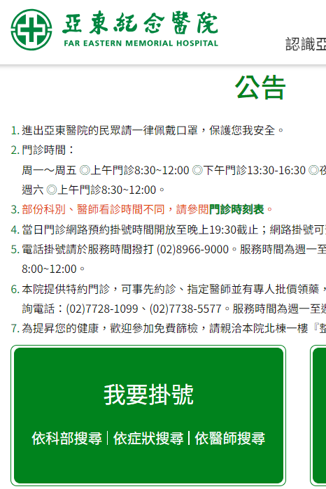
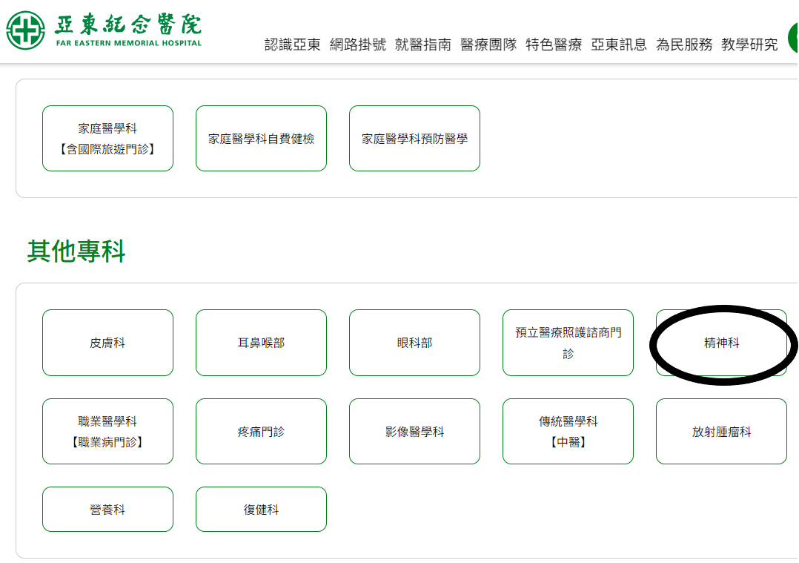
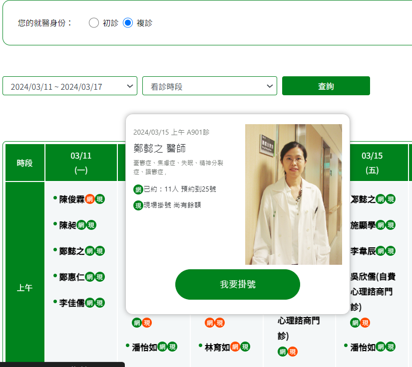
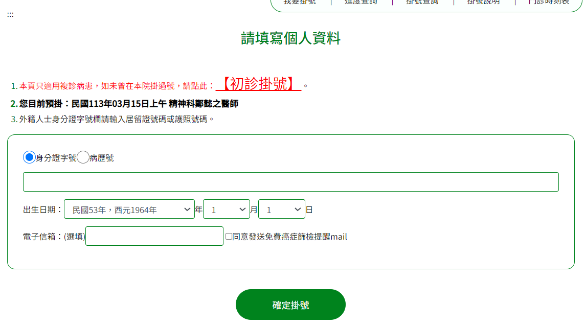
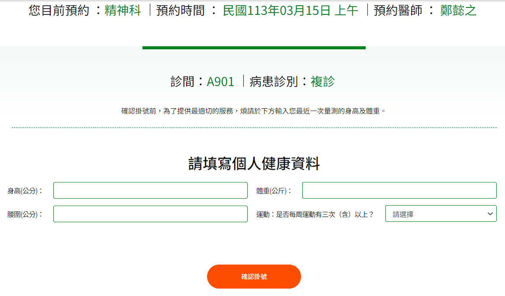
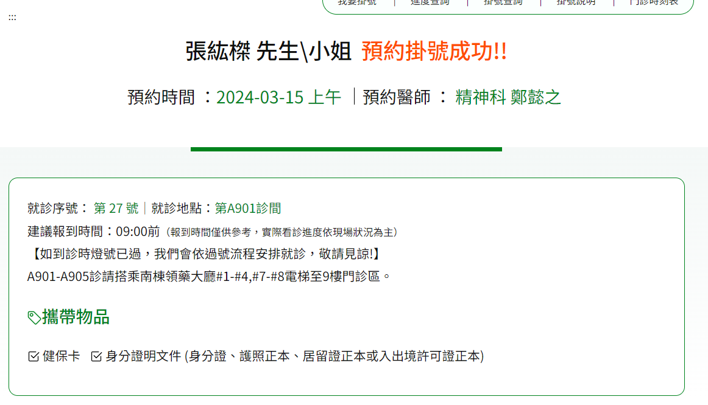

# 第2次作業-作業-HW2
>
>學號：111111102
> 
>姓名：張紘榤
> 
>作業撰寫時間：30 (mins，包含程式撰寫時間)
> 
>最後撰寫文件日期：2024/03/18
>

本份文件包含以下主題：(至少需下面兩項，若是有多者可以自行新增)
- [x] 說明內容
- [x] 個人認為完成作業須具備觀念

## 說明程式與內容
1.開啟亞東醫院網路掛號系統並選擇科別。  
物件：掛號、掛號查詢、進度查詢、預約遠距診療、預約公費疫苗  

2.選擇科別進行預約  
類別：各門診分部，物件：門診科別  

3.選擇好日期與醫生進行掛號  
物件：初/複診、可選擇時間、醫師名稱  

4.填寫個人資料  
物件：身分證、病歷號、出生日期、電子信箱  

5.填寫個人健康資料  
物件：身高、體重、腰圍、運動  

6.預約成功於指定日期看診  
物件：姓名稱呼、預約時間、預約醫師、就診序號、就診地點、攜帶物品健保卡/身分證  

## 個人認為完成作業須具備觀念
這次作業首先要先決定系統所需要的物件，利用drawio繪畫出物件導向方法的圖
和繪畫出UML關鍵符號的圖，也要理解物件之間的交互關係。